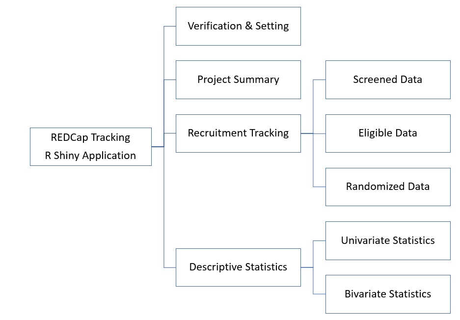

<!-- README.md is generated from README.Rmd. Please edit that file -->

```{r, include = FALSE}
knitr::opts_chunk$set(
  collapse = TRUE,
  comment = "#>"
)
```

# REDCap Recruitment Tracker

<!-- badges: start -->
<!-- badges: end -->


[REDCap](https://www.redcap.ihrp.uic.edu/) (Research Electronic Data Capture) is a nationwide online survey and database. To visualize any project involving  a randomized controlled trial (RCT) in REDCap, researchers can use the R Shiny application called Recruitment Tracker. Recruitment Tracker aims to establish a free, interactive, and web-based dashboard [(https://uicccts.shinyapps.io/REDCap_Tracking/)](https://uicccts.shinyapps.io/REDCap_Tracking/). The platform R Shiny allows users to interact with and visualize the data according to their needs. The main function of this dashboard is to track the recruitment progress of an RCT project using tools and functionalities that provide real-time statistical results. Thus, this dashboard can support users in making decisions about recruitment progress and data collection based on the tracking reports.

The secondary function of the Recruitment Tracker is to visualize the characteristics of the participants assigned to receive randomization in RCTs. Researchers can perform univariate and bivariate analyses on all demographic and clinical variables of interest. All the results in the Recruitment Tracker presented in graphs and tables are able to be downloaded.

The workflow of the modules of this interactive online dashboard is illustrated below. Recruitment Tracker displays the dataset in four modules of interest for users: "Verification & Setting," "Project Summary," "Recruitment Tracking," and "Descriptive Statistics." Recruitment Tracker was made publicly available in December 2022. Advanced R users may request the R Shiny code to adapt the code for their specific visualization of R Shiny apps.

For detailed instructions for using Recruitment Tracker, see the [user guide](REDCapRecruitmentTracker_UserManual.pdf).

```{r, fig.cap="Workflow and modules of the interactive web-based dashboard for REDCap Recruitment Tracker R Shiny App", echo = FALSE}

```
