```{r setup, include=FALSE}
knitr::opts_chunk$set(
	echo      = FALSE, 
	eval      = TRUE, 
	out.width = '100%', 
	fig.pos   = "H", 
	out.extra = "", 
	fig.show  = 'hold', 
	fig.align = 'center'
	)
```

 
## Purpose 

[REDCap](https://www.redcap.ihrp.uic.edu/) (Research Electronic Data Capture) is a nationwide online survey and database. To visualize any project involving  a randomized controlled trial (RCT) in REDCap, researchers can use the R Shiny application called Recruitment Tracker. Recruitment Tracker aims to establish a free, interactive, and web-based dashboard [(uicccts.shinyapps.io/REDCap_Tracking)](https://uicccts.shinyapps.io/REDCap_Tracking/). The platform R Shiny allows users to interact with and visualize the data according to their needs. The main function of this dashboard is to track the recruitment progress of an RCT project using tools and functionalities that provide real-time statistical results. Thus, this dashboard can support users in making decisions about recruitment progress and data collection based on the tracking reports.

The secondary function of the Recruitment Tracker is to visualize the characteristics of the participants assigned to receive randomization in RCTs. Researchers can perform univariate and bivariate analyses on all demographic and clinical variables of interest. All the results in the Recruitment Tracker presented in graphs and tables are able to be downloaded.

The workflow of the modules of this interactive online dashboard is illustrated in Figure \@ref(fig:fig-1). Recruitment Tracker displays the dataset in four modules of interest for users: "[Verification & Setting](#module-1.-verification-setting)," "[Project Summary](#module-2.-project-summary)," "[Recruitment Tracking](#module-3.-recruitment-tracking),"
and "[Descriptive Statistics](#module-4.-descriptive-statistics)." Recruitment Tracker was made publicly available in December 2022. Advanced R users may request the R Shiny code to adapt the code for their specific visualization of R Shiny apps.


```{r fig-1, fig.cap="Workflow and modules of the interactive web-based dashboard for REDCap Recruitment Tracker R Shiny App"}
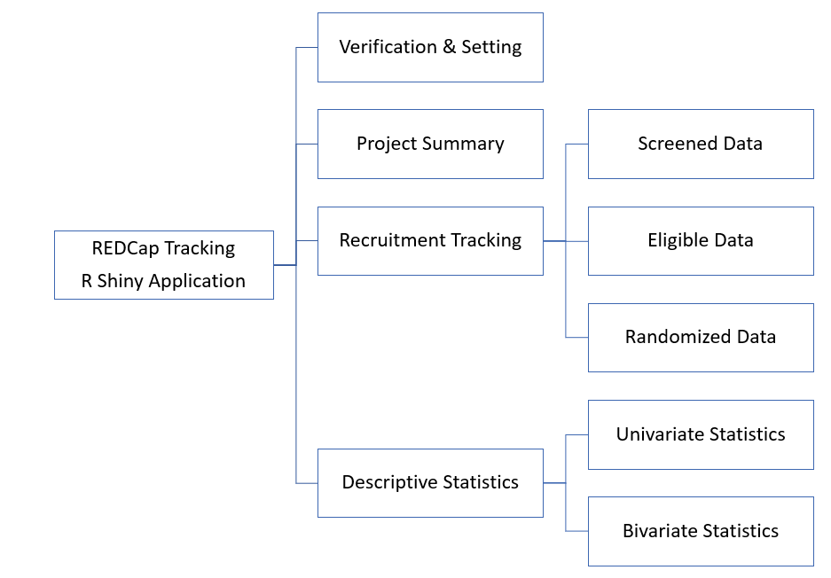
```


## Module 1. Verification & Setting 

This module is designed to import the user’s long-form longitudinal dataset involving an RCT in REDCap (Figure \@ref(fig:fig-2) demonstrates the long-form format of an example dataset). Also, users must provide recruitment goals to compare with recruitment progress. 


```{r fig-2, fig.cap="An example of a long-form dataset"}
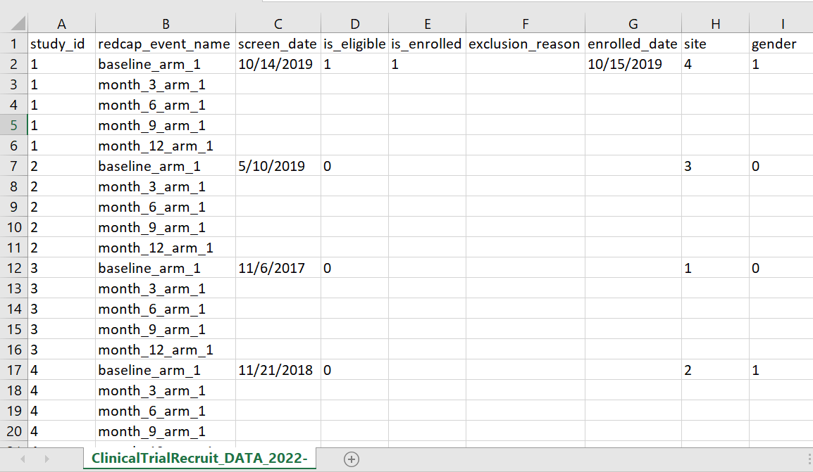
```


### Instructions

#### Step 1
To import the dataset, users need to provide the token of the REDCap project of interest. Please note that it will appear as asterisks to ensure data confidentiality as you enter the token.

Then, the real-time dataset can be pulled from the online REDCap database directly. This dashboard will not import or analyze any variable involving personal information (i.e., identifier) to protect data privacy. Once the data are imported, variables are automatically separated into categorical variables and numerical variables—based on the data dictionary (codebook)—for the purpose of visualization and analyses.

#### Step 2
To produce the tracking statistics of the RCT project, users need to enter the following information into the boxes: 

* `Research Period of this Clinical Trial Project`
* `Total Targeted Number of Screened Participants`
* `Expected Rate of Eligibility`
* `Expected Rate of Randomization`


```{r fig-3, fig.cap="Import the REDCap dataset via project token and then provide the initial setting information"}

```

#### Step 3
To identify the RCT selection process variables in REDCap, users need to provide the five variable names assigned to the information below. This app will present the recruitment progress based on the results of these five variables.

1. The date that the participant received the screening process (following the code rule: yyyy-mm-dd)
2. Participant eligibility (following the code rule: 1 = Yes and 0 = No)
3. Exclusion reason for the RCT project (no code rule)
4. Whether the participant receives the randomization (following the code rule: 1 = Yes and 0 = No)
5. The date that the participant received the randomization (following the code rule: yyyy-mm-dd)

#### Step 4 (Optional)
Users can upload the variable list in the `Variable List (Optional)` box to observe specific variables of interest rather than all variables in the dataset. The content of the file should follow the rules below:

1. All the variable names match those in REDCap, including both spelling and capitalization. Please note that the variable list does not need to include the five variable names mentioned in Step 3.
2. All the variable names are listed in column 1 of the file (see Figure \@ref(fig:fig-4)).
3. Rename "Sheet 1" on the Excel file to "variables."
4. Please save the Excel file as a CSV file format.

Once the file is successfully uploaded, the message below the `Import` button will show "Uploaded file: filename.csv."


```{r fig-4, fig.cap="The data format of the optional variable list file (CSV file only)", out.width="15%"}
knitr::include_graphics("images/optional_variable_list_file.png")
```


#### Step 5
Once all the information is given, please press the green button labeled `Search`. If the message below the `Search` button shows "Dataset Successfully Imported," it indicates that the dataset was imported from the REDCap database correctly, and the statistical results are ready to be revealed in the dashboard. However, the message will show "Fail to find the REDCap Data" if users provide the wrong RCT project token in REDCap or the wrong data format rule of the uploaded variable list. Then, users need to follow the above rules and go back to Step 1.

#### Step 6 (Optional)
To save time for the future use of this dashboard, users can store all the setting information in Steps 1 to Step 4. After the message "Dataset Successfully Imported" is shown on the window, please press the green button labeled `Export` located below "Setting (Optional)." Then, all the setting information (including the optional variable list) will be exported into a downloaded JSON file to the user's local desktop. Next time, when users want to use   Recruitment Tracker, they can click the green button labeled `Import` and upload the JSON file. After doing this, users can press the green bottom labeled `Search` and import the data directly.
 


 

 
### Example 

This example demonstrates how to use this dashboard's module of "Verification & Setting." (see Figure \@ref(fig:fig-5)). First, we provide the token `A0C6E1AA3B6FF2F1EBF4A184FABE4378`, of an artificial project we created in the REDCap database. The research period of this project is from 2017-07-01 to 2020-06-30. The total targeted number of screened participants is 2450, with an expected eligibility rate of 0.25 and an expected randomization rate of 0.90. In other words, in this RCT project, the total expected number of the randomized participants is 551.25 (= 2450 x 0.25 x 0.90). We randomly assigned the participants to receive either standard treatment or new treatment in this project.

The variable names for screening date, participant eligibility, the exclusion reason, randomization, and randomization date are `screen_date`, `is_eligible`, `exclusion_reason`, `is_enrolled`, and `enrolled_date`, respectively. Since we  prefer to analyze a specific variable list, we upload a CSV file named "variable.csv." Once we click the button of `Search`, the message below `Search` should show "Dataset Successfully Imported." Then, we can further observe the statistical results in the "Project Summary," "Recruitment Tracking," and "Descriptive Statistics" modules.


```{r fig-5, fig.cap="Import the REDCap example dataset via token and provide the initial setting information"}
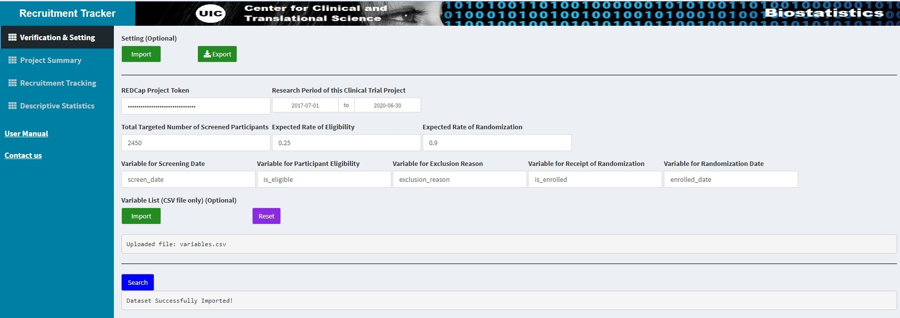
```
 
## Module 2. Project Summary 
After the data is successfully imported, this module provides the summary report of the RCT project. Figure \@ref(fig:fig-6) shows the summary of the example dataset. The research period of this RCT project is from 2017-07-01 to 2020-06-30. The total number of screened participants is 2450 in a total of 4 sites. Among the screened participants, 650 were eligible for the RCT project. Among the eligible participants, there are 75 eligible participants excluded from the randomization step. The exclusion reasons include "Not meeting the inclusion criteria" (38), "Declined to participate" (20), and "Other reasons" (17).


```{r fig-6, fig.cap="Project Summary of the example dataset"}
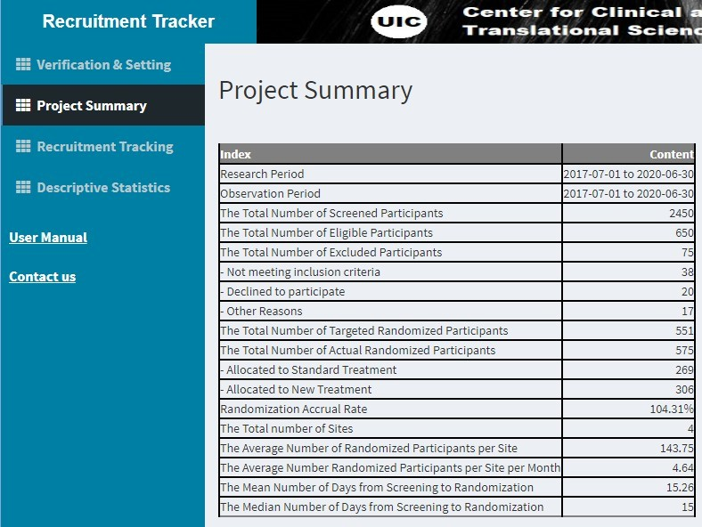
```
 
Among the 575 participants (= 650 - 75) who received randomization, 269 received the standard treatment while 306 received the new treatment. The randomization accrual rate is 104.31% (= actual 575 / target 551.25). The average number of randomized participants per site is 143.75 (= 575 / 4). The mean number of days from screening to randomization is 15.26, and the median is 15.

## Module 3. Recruitment Tracking 
This module aims to track the screening, eligibility, and randomization progress. In the input panel, users need to decide the observation period, the unit of time (week/quarter/month/year), the stratified variable, and the substratified variable. Then, the corresponding plot will be revealed in the output panel. Users can utilize the green buttons labeled `HTML`, `PNG`, and `EXCEL` to download the interactive plot, static plot, and tracking report to the local desktop.


### Tab 1. Screened Data
The tab "Screened Data" helps users visualize the real-time tracking statistics of the participants who received the screening process in the RCT project. For example, suppose users decide to observe the overall weekly statistics without stratifying any variables during the observation period from 2017-07-01 to 2020-06-30. In that case, the plot will be as demonstrated in Figure \@ref(fig:fig-7). Users can interact with the plot by clicking any point on the line, and the statistics will be displayed simultaneously. Figure \@ref(fig:fig-7) shows that the cumulative number of screened participants in week 51, ending on 2018-06-22, is 973. If users click on `EXCEL`, an Excel file that includes the weekly tracking report is downloaded to the local desktop (see Figure \@ref(fig:fig-8)).


```{r fig-7, fig.cap="Tracking Statistics - Plot - Screened Weekly Data"}
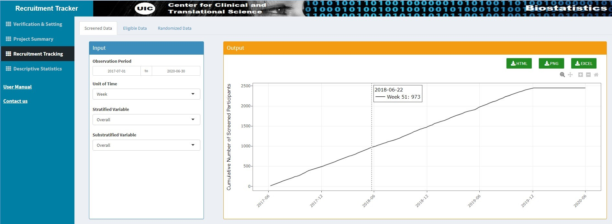
```
 


```{r fig-8, fig.cap="Tracking Statistics - Table - Screened Weekly Data", out.width="70%"}
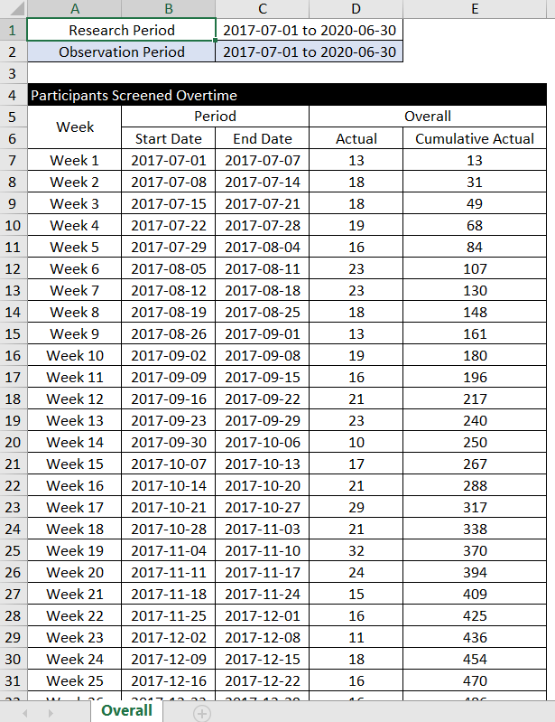
```
 
If users decide to observe the weekly statistics by stratifying the variable gender during the observation period from 2017-07-01 to 2020-06-30, the interactive plot is shown in Figure \@ref(fig:fig-9). At the end of week 51 (2018-06-22), the cumulative number of participants who received a screening at sites Chicago, New York, Houston, and Los Angeles were 229, 238, 231, and 275, respectively. Again, the users can also obtain a weekly report stratified by the variable site when clicking on the `EXCEL` button. In the worksheet "Summary," the number of total screened participants stratified by the site is  shown in Figure \@ref(fig:fig-10). In the worksheet "Stratified," the weekly report is stratified by the site (see Figure \@ref(fig:fig-11)).


```{r fig-9, fig.cap="Tracking Statistics - Plot - Screened Weekly Data Stratified by Site"}
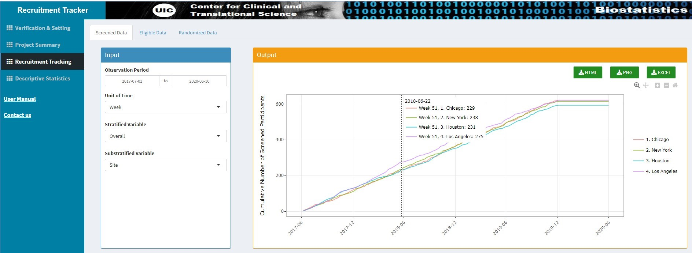
```
 


```{r fig-10, fig.cap="Tracking Statistics - Summary Table - Screened Data Stratified by Site", out.width="45%"}
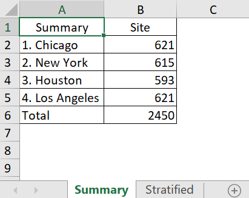
```


```{r fig-11, fig.cap="Tracking Statistics - Stratified Table - Screened Weekly Data Stratified by Site"}
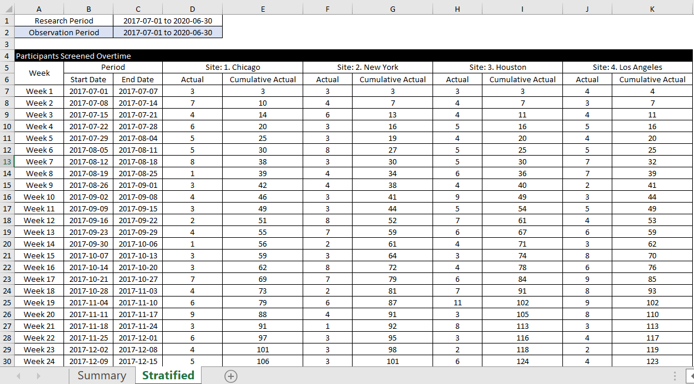
```
 
### Tab 2. Eligible Data 
The tab "Eligible Data" helps users visualize the real-time tracking statistics of the eligible participants in the RCT project. Similar to the operation of the "Screened Data" tab, if users decide to observe the monthly statistics by stratifying the variable gender during the observation period from 2017-07-01 to 2017-12-31, the interactive plot is shown in Figure \@ref(fig:fig-12). Users can interact with the plot to further monitor the monthly eligibility of different genders. For instance, until the end of month 3 (ending on 2017-09-30), the cumulative number of male participants eligible for this RCT project is 48. Again, the users can also obtain a report stratified by the variable gender when clicking on the `EXCEL` button (see Figure \@ref(fig:fig-13)).


```{r fig-12, fig.cap="Tracking Statistics - Plot - Eligible Monthly Data Stratified by the Variable Gender"}
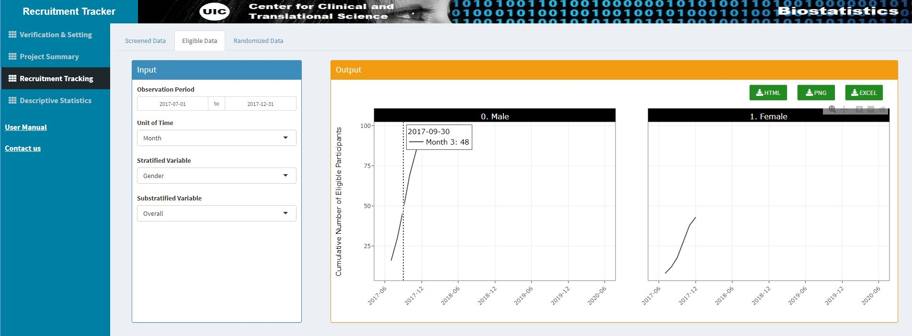
```
 

 

```{r fig-13, fig.cap="Tracking Statistics - Table - Eligible Monthly Data stratified by the Variable Gender", out.width="70%"}
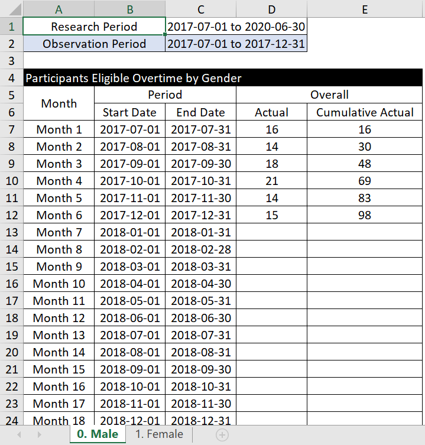
```
 
### Tab 3. Randomized Data 
The tab "Randomized Data" helps users visualize the real-time tracking statistics of the participants who received the randomization in the RCT project. Similar to the operation of the "Screened Data" tab, the interactive plot is shown if users decide to observe the monthly statistics by stratifying the variables site and gender during the observation period from 2017-07-01 to 2020-06-30 (see Figure \@ref(fig:fig-14)). Users can interact with the plot to further monitor the monthly randomization at different sites and genders. For instance, until the end of month 19 (ending on 2019-01-31), the cumulative target and the cumulative actual number of female participants who received the randomization at site Houston were 36.1 and 58, respectively.  Again, the users can also obtain a report stratified by the variable site and gender when clicking on the `EXCEL` button (see [Figures 15-16](#fig-15)).


```{r fig-14, fig.cap="Tracking Statistics - Plot - Randomized Monthly Data Stratified by the Variable Site and Gender"}
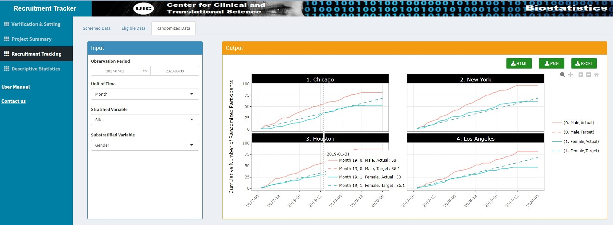
```
 


```{r fig-15, fig.cap="Tracking Statistics - Summary Table - Randomized Data stratified by the Variable Site and Gender", out.width="70%"}
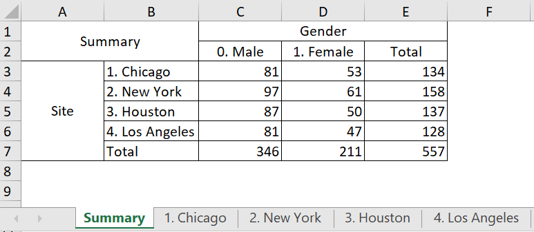
```


 

```{r fig-16, fig.cap="Tracking Statistics - Table - Randomized Monthly Data stratified by the Variable Site and Gender"}
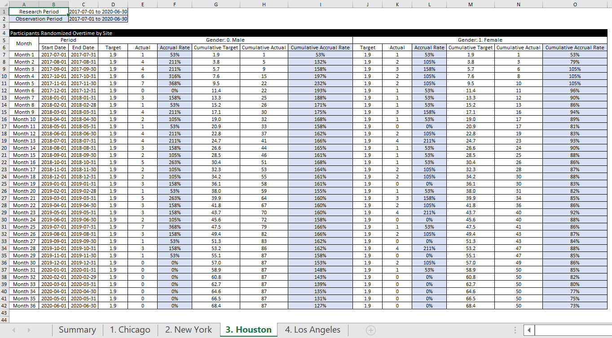
```
 
## Module 4. Descriptive Statistics
This module aims to visualize the real-time characteristics of participants who received the treatment’s randomization in the RCT project. Users can perform univariate and bivariate analyses on all the variables of interest. In the tab   "Univariate Statistics," users need to decide the variables of interest to perform the analysis in the input panel. Users can choose multiple variables in the input panel and then obtain corresponding plots simultaneously in the output panel.

### Tab 1. Univariate Analysis 

#### Categorical Variable – Bar Chart
The procedure to analyze categorical variables is as follows. Users must select the variables of interest in the `Categorical Variables` box in the input panel. Then the corresponding bar charts will be displayed in the output panel. When users click on one of the bars within the plot, the count and percentage will be revealed. The sample size for the total, valid, and missing participants is displayed under the title of the plot (i.e., the variable name). Users can utilize the green button labels `HTML`, `PNG`, and `EXCEL` to download the interactive plot, static plot, and frequency table to the local desktop.

For example, if the variable "Gender" is selected, then the interactive bar chart is shown in Figure \@ref(fig:fig-17). The title of the plot is "Gender," and the sample size for the total, valid, and missing participants are 575, 557, and 18, respectively. When users click on the bar "Male," it will show that the count (valid sample size) for the Male  group is 346, and that percentage is 62.1% (= 346 / 557). If users click on the `EXCEL` button, an excel file that includes the frequency table for the variable "Gender" is downloaded to the local desktop (see Figure \@ref(fig:fig-18)).

 

```{r fig-17, fig.cap="Univariate Statistics – Bar Chart for Categorical Variable 'Gender'"}
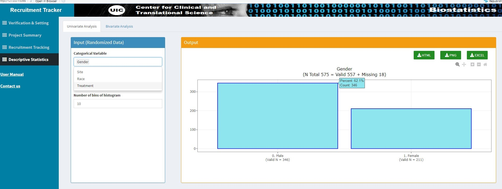
```

 

```{r fig-18, fig.cap="Univariate Statistics – Frequency Table for Categorical Variable 'Gender'"}
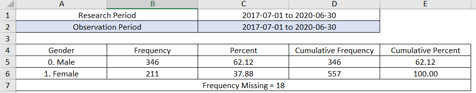
```
 
#### Numerical Variable - Histogram
The procedure to analyze numerical variables is as follows. Users must select the variables of interest in the box labeled `Numerical Variable` and decide the number of bins of the histogram (the default value is 10) in the input panel. The corresponding histogram will be displayed on the output panel. When users click on one of the bars within the plot, the bar's count and range will be revealed. The sample size and the summary statistics, including Mean/SD/Median/IQR, will be displayed under the title of the plot.

For example, if the variable "BMI" is selected, the interactive histogram is shown in Figure \@ref(fig:fig-19). The title of the plot is "BMI," and the sample size for the total, valid, and missing participants are 575, 575, and 0, respectively. The summary statistics of the variable BMI, including Mean, SD, Median, IQR, are 26.44, 3.55, 26.32, and 5.00, respectively. When users click on the bar between the group "30-32," it will show that the count of this group is
62. Users can also download the table to observe this BMI's minimum, first quartile (Q1), third quartile (Q3), and maximum values (see Figure \@ref(fig:fig-20)).


```{r fig-19, fig.cap="Univariate Statistics – Histogram for Numerical Variable 'BMI'"}
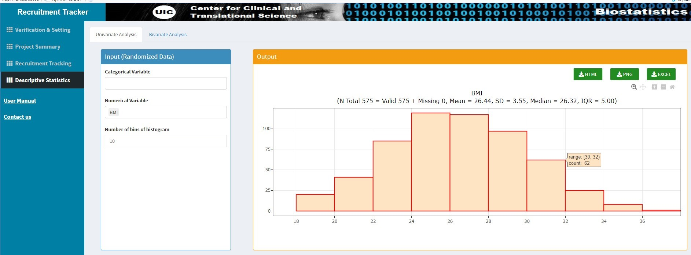
```


```{r fig-20, fig.cap="Univariate Statistics – Summary Statistics for Numerical Variable 'BMI'"}
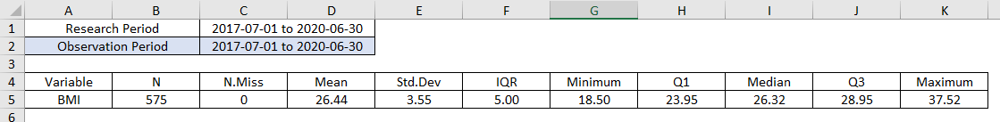
```
 
### Tab 2. Bivariate Analysis 
In the "Bivariate Statistics" tab is the stratified results. Stratified statistics identify the relationship between two variables by breaking up the data into smaller groups, or strata, to look for differences between and within each stratum. Using  this dashboard, users need to decide the primary and the stratified variables to perform the stratified analysis. The stratified variable will separate the primary variable (i.e., the fixed option) into groups. In the input panel, users first  select the primary variable from the drop-down variable list, then choose one or multiple stratified variables (i.e., one or more options) to perform the stratification. Once these variables are decided, the corresponding plots will be simultaneously displayed in the output panel.

#### Primary - Categorical Variable vs. Stratified - Categorical Variable: Stratified Bar Chart
The stratified bar chart will be displayed in the output panel if we would like to observe the relationship between two categorical variables. For example, when the primary variable "Treatment" and the stratified variable "Gender" are chosen, the interactive bar chart with the title "Treatment by Gender" is shown in Figure \@ref(fig:fig-21). The sample size for the total, valid, and missing participants is 575, 557, and 18. When users click on the bar
"Female" within the group of "Standard Treatment," it will show that the count of the female who received "Standard Treatment" is 167, with a percentage of 64.0% (= 167 / 261). If users click on the `EXCEL` button, the contingency table—which contains the stratified results—will be downloaded as an excel file (see Figure \@ref(fig:fig-22)).

 

```{r fig-21, fig.cap="Bivariate Statistics – Bar Chart for the Variable 'Treatment' Stratified by 'Gender'"}
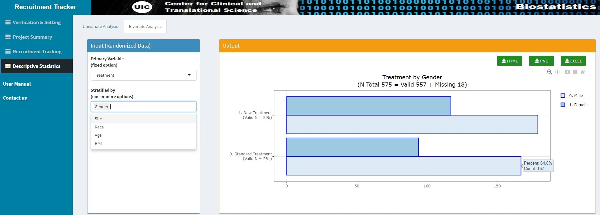
```
 

 

```{r fig-22, fig.cap="Bivariate Statistics – Contingency Table for the Variable 'Treatment' Stratified by 'Gender'"}
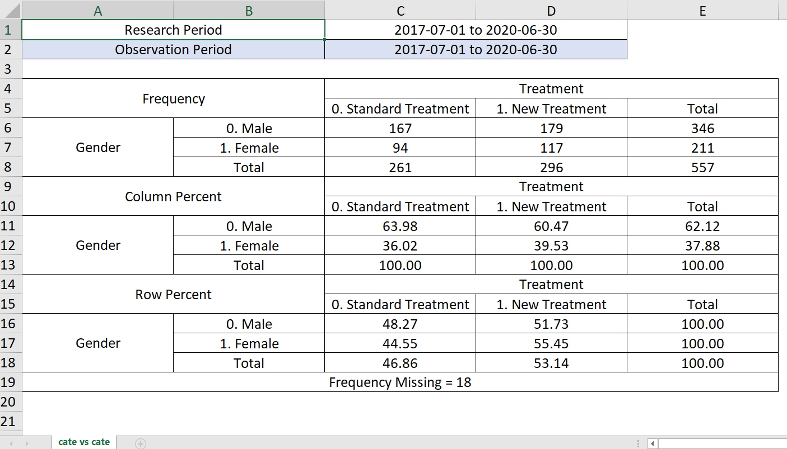
```
 
#### Primary - Categorical Variable vs. Stratified - Numerical Variable: Grouped Boxplot
A boxplot is a standardized method of displaying the distribution of the data based on the summary statistics of a given variable, which include minimum (min), first quartile (q1), median (q2), third quartile (q3), and maximum (max). Also, this plot will indicate the value of outliers. A grouped boxplot is the visual representation of the difference in the subgroup distribution, which users can utilize to observe the relationship between a categorical and numerical variable.

For example, Figure \@ref(fig:fig-23) demonstrates that the variable "Age" is stratified by "Treatment." The grouped boxplot visualizes the distribution of two subgroups of "Treatment," including "Standard Treatment" and "New Treatment." The age distribution among the two types of treatments looks similar. To examine the age distribution of   standard treatment, users may click on the green box "Standard Treatment," and then the summary statistics will be shown in the plot. The median age among the participants who received standard treatment is 50, with min of 18 and max of 75. Again, the users can also obtain stratified summary statistics when clicking on the `EXCEL` button (see Figure \@ref(fig:fig-24)).

 
```{r fig-23, fig.cap="Bivariate Statistics – Grouped Boxplot for the Variable 'Age' Stratified by 'Treatment'"}
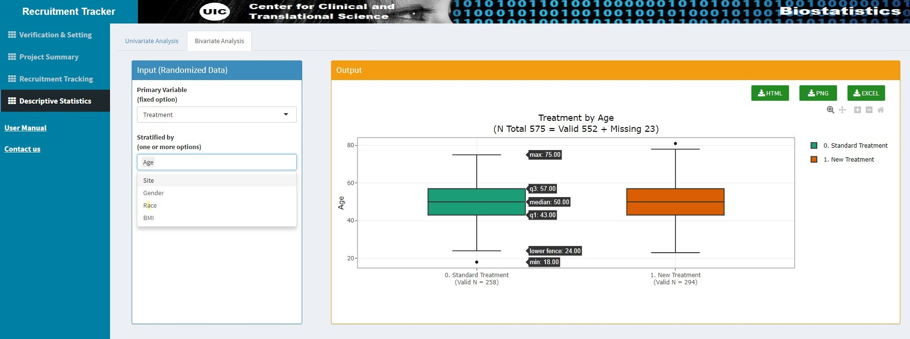
```


 

```{r fig-24, fig.cap="Bivariate Statistics – Stratified Summary Statistics for the Variable 'Age' stratified by 'Treatment'"}
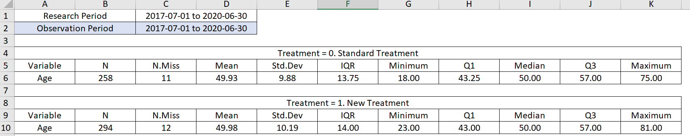
```
 
#### Primary - Numerical Variable vs. Stratified - Numerical Variable: Scatter Plot
The most straightforward stratified plot is an X-Y plot with the measured variable on the vertical axis and a variable describing the different strata on the horizontal axis. Thus, we will use the scatter plot to observe the relationship between two numerical variables. The scatter plot will be displayed in the output panel once the primary and stratified variables are chosen in the input panel. To describe the overall trend of the data, a polynomial model (the blue curve) with its 95% confidence interval (the gray area) is included in the plot. If users want to know the value of the paired data, they can click on any black point on the scatter plot, and the  numerical value of the two variables will be displayed.

For example, when the primary variable "Age" and the stratified variable "BMI" are chosen, the interactive bar chart with the title "Treatment by BMI" is shown in Figure \@ref(fig:fig-25). The sample size for the total, valid, and missing participants is 575, 552, and 23. The primary variable, "Age," will be on the horizontal axis, and the stratified variable, "BMI," will be on the vertical axis. If users click the point in the lower-left corner, then the value of the point will be revealed (Age = 23, BMI =22.80). Users can further download the table of stratified summary statistics to observe Pearson correlation and Spearman correlation by clicking the `EXCEL` button (see Figure \@ref(fig:fig-26)).

 

```{r fig-25, fig.cap="Bivariate Statistics – Scatter Plot for Numerical Variables 'Age' and 'BMI'"}
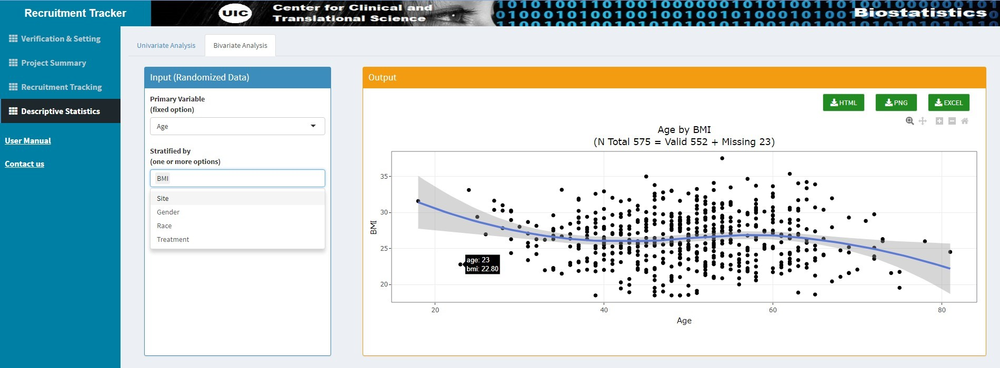
```

 

```{r fig-26, fig.cap="Bivariate Statistics – Stratified Summary Statistics for Numerical Variables 'Age' and 'BMI'"}
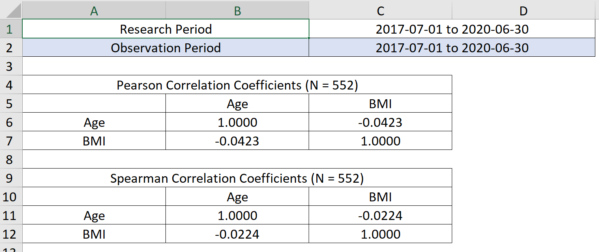
```
 
#### Primary - Numerical Variable vs. Stratified - Categorical Variable: Grouped Boxplot

If the primary variable is a numerical variable "Age" and the stratified variable is a categorical variable "Site", then Figure \@ref(fig:fig-27) demonstrates that the variable "Age" is stratified by "Site." The grouped boxplot visualizes the distribution of four subgroups of "Site," including "Chicago," "New York," "Houston," and "Los Angeles." The age distribution among the four sites looks similar to each other. To examine the age distribution of the site Chicago, users may click on the green box "Chicago," and then the summary statistics will be shown in the plot. The median age among Chicago participants is 51, with min of 26 and max of 75. Users can further download the table of stratified summary statistics by clicking the `Table` button (see Figure \@ref(fig:fig-28)).


```{r fig-27, fig.cap="Bivariate Statistics – Grouped Boxplot for Variable 'Age' Stratified by 'Site'"}
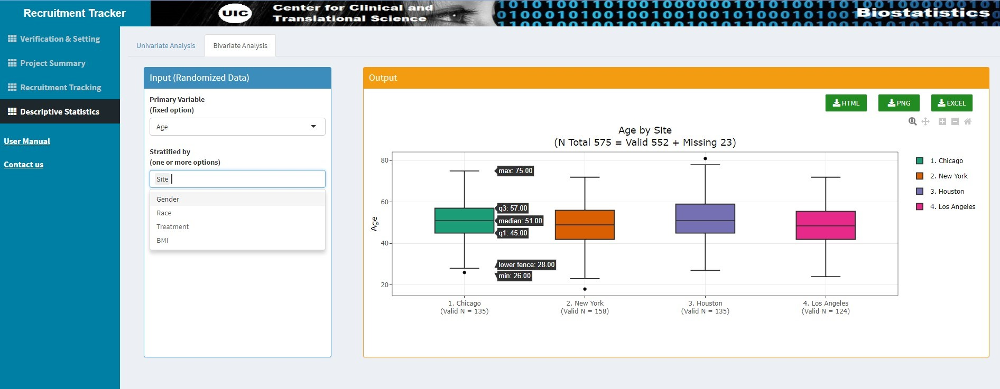
```


```{r fig-28, fig.cap="Bivariate Statistics – Stratified Summary Statistics for the Variable 'Age' stratified by 'Site'"}
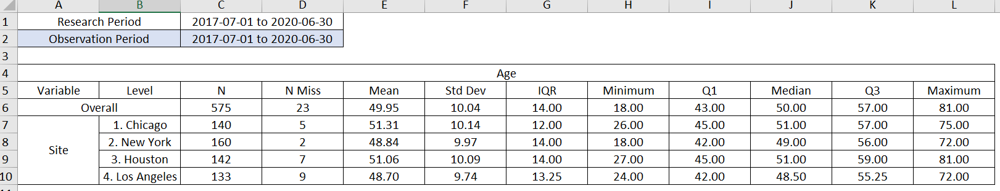
```
